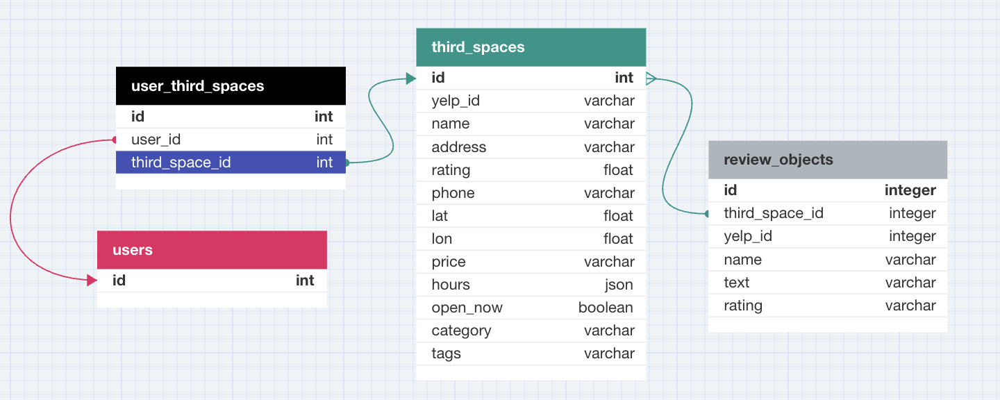

# third_space_be

# Third Space
> This product aims to help users find locations for leisure activities near them which fit their mood and needs.

The third place is disappearing; a physical location to go to between work/school and home. This application aims to help people find a sense of connection by allowing users to input their current mood and likes with a response of places that may help them find a sense of inclusion (or just help them destress from their daily lives).


## Installation

OS X & Linux:
This project runs on Rails 7.0.8.

Fork and clone [this repository](https://github.com/shawndcarpenter/third_space_fe), which is the front-end of our application.

Fork and clone [this repository](https://github.com/shawndcarpenter/third_space_be) to access our back-end.

Windows:

This product is not compatible with Windows.

## API
This application uses the Yelp API to access the locations through the back-end API calls. You can receive a free API key from Yelp [here](https://docs.developer.yelp.com/docs/fusion-intro).

### To use this API key 
1. Enter the following in your terminal:

```sh
EDITOR="code --wait" rails credentials:edit
```
2. In the window that has opened, titled credentials.yml.enc, add the following. Make sure that key is on a new line with a tab before it.

```sh
yelp:
 key: Bearer the_api_key_given_to_you
```
3. Close this file to save your credentials.
### Business Search
All businesses on the Yelp API are searched for with paramters. More information can be found [here](https://docs.developer.yelp.com/reference/v3_business_search), including other possible search terms not used in this application.

### Detailed Business
A single business matching a yelp_id on the Yelp API can be found [here](https://docs.developer.yelp.com/reference/v3_business_info). The detailed business includes more information that we did not use in this application.

### Business Reviews
Reviews for a single business matching a yelp_id on the Yelp API can be found [here](https://docs.developer.yelp.com/reference/v3_business_reviews).

## Why Use Third Space?

There are plenty of people who, for a variety of reasons, may wish to find a location to relax beyond their home. This application takes into account the following needs:
1. Mood
2. Accessibility Needs
3. Money the user wishes to spend
4. Whether the space is sober

## Moods Accounted For
1. Calm
2. Studious
3. High Energy
4. Loud
5. Quiet
6. Relaxed
7. Friendly

To provide feedback (including ideas for other moods to be added to our list), contact one of our members in the Staff list below or create a pull request using the instructions outlined in Contributing.

## Development setup
Download both our [front end](https://github.com/shawndcarpenter/third_space_fe) and [back end](https://github.com/shawndcarpenter/third_space_be) applications.

Start the server on the back end and front end applications by typing the following in the terminal of both.

```sh
rails s
```

NOTE: On a local host, back-end application should be running on PORT 3000, while the front-end application should be running on PORT 5000.

Run the following code in your terminal to install the gems required to use this application:
```sh
bundle install
```

Check to make sure all the tests are passing by running the following code in your terminal:
```sh
bundle exec rspec
```

## Gem Information
The front end repository handles most of what the user will interact with, including routing and page rendering. 

[Bootstrap](https://github.com/twbs/bootstrap-rubygem) was used extensively for design on the front end.

### Testing
XXX check over all backend gems

The [Shoulda Matchers Gem](https://github.com/thoughtbot/shoulda-matchers) is used for one-liner testing of models.

The [SimpleCov Gem](https://github.com/simplecov-ruby/simplecov) provides test coverage analysis for our application.

The [FactoryBot](https://github.com/thoughtbot/factory_bot) and [Faker Gems](https://github.com/faker-ruby/faker) was used to create large amounts of data for testing. 

The back end handles API calls to the Yelp API as well as accepts post requests from the user for location moods. It simulates API calls using the [WebMock gem](https://github.com/bblimke/webmock) and the [VCR gem](https://github.com/vcr/vcr).

Both front end and back end use the [Pry gem](https://github.com/pry/pry) and [RSpec Rails](https://github.com/rspec/rspec-rails) within the testing environment for unit and feature testing.

The [Bullet gem](https://github.com/flyerhzm/bullet) is used to track N+1 queries.

# Schema

# How to Use the API
The possible requests are divided into locations, which are taken from the Yelp API, and Third Spaces, which are provided to the front end from this application.

## Locations
### GET Locations
A request is received in which all locations matching the parameters are asked for.
This application makes an API call to the Yelp API for the results of the search parameters in this format, with the Authorization header being taken from the credentials file:

```sh
get https://api.yelp.com/v3/businesses/search?location=:city&term=:name
headers["Authorization"] = Rails.application.credentials.yelp[:key]
```

Then, a response is given which includes the top 50 locations matching the search criteria.

*Locations will receive the following input:*

```sh
GET "/api/v1/locations/search_locations",
params = ({name: "Business Name",
          city: "Business City"
                })
```

*And return the following output to the front end application:*

```sh
{:data=>
  [{:id=>"location_id",
    :type=>"search_result",
    :attributes=>
     {:id=>"location_id", :name=>"Location Name", :address=>"Location Address", :category=>"Location Category"}},
   {:id=>"location_id",
    :type=>"search_result", ...
```

### GET One Detailed Location
A request is received in which a location is asked for matching the yelp_id provided.
This application makes an API call to the Yelp API for the reviews of that location in this format, with the Authorization header being taken from the credentials file:

```sh
get https://api.yelp.com/v3/businesses/:yelp_id
headers["Authorization"] = Rails.application.credentials.yelp[:key]
```

Then, a response is given which includes that location.

*Locations will receive the following input:*
```sh
GET "/api/v1/locations/:id"
```
*And return the following output to the front end application:*

```sh
{:data=>
 {:id=>id,
   :type=>"detailed_location",
   :attributes=>
    {:yelp_id=>"yelp_id",
     :name=>"Business Name",
     :address=>"1234 Business Ave S, Minneapolis, MN 12345",
     :rating=>4.5,
     :phone=>"(555) 123-4567",
     :photos=>
      ["photopath.jpg",
       "photopath2.jpg"],
     :lat=>float,
     :lon=>float,
     :price=>"$$",
     :hours=>
      [{:open=>
         [{:is_overnight=>false, :start=>"0700", :end=>"1800", :day=>0},
          {:is_overnight=>false, :start=>"0700", :end=>"1800", :day=>1},
          {:is_overnight=>false, :start=>"0700", :end=>"1800", :day=>2},
          {:is_overnight=>false, :start=>"0700", :end=>"1800", :day=>3},
          {:is_overnight=>false, :start=>"0700", :end=>"1800", :day=>4},
          {:is_overnight=>false, :start=>"0700", :end=>"1800", :day=>5},
          {:is_overnight=>false, :start=>"0700", :end=>"1800", :day=>6}],
        :hours_type=>"REGULAR",
        :is_open_now=>true}],
     :category=>"category",
     :open_now=>true}}}
```

### GET Reviews For A Location
A request is received for the reviews for the location matching the :id. This application makes an API call to the Yelp API for the reviews of that location in this format, with the Authorization header being taken from the credentials file:

```sh
get https://api.yelp.com/v3/businesses/:yelp_id/reviews?limit=5
headers["Authorization"] = Rails.application.credentials.yelp[:key]
```

Then, a response is given which includes the top 5 reviews for that location.

*Locations will receive the following input:*
```sh
GET "/api/v1/locations/:id/reviews"
```
*And return the following output to the front end application:*

```sh
{:data=>
  [{:id=>"id",
    :type=>"review",
    :attributes=>
     {:id=>"id",
      :rating=>5,
      :text=>
       "Some of the best coffee and tea around. They usually have some great breakfast snacks to offer...",
      :name=>"Jeremy S.",
      :yelp_id=>"id"}},
   {:id=>"id", ...
```

## Third Spaces
### GET One Third Space
A request is received with the yelp_id. A response of the third space matching that yelp_id is returned.

*Third Spaces will receive the following input:*
```sh
GET "/api/v1/locations/:yelp_id"
```

*And return the following output to the front end application:*

```sh
{:data=>
 {:id=>"3975",
 :type=>"third_space",
 :attributes=>
  {:yelp_id=>"NmS9OJcWvt2b0T5HBhevyA",
   :name=>"Flagstaff House Restaurant",
   :address=>"1138 Flagstaff Rd, Boulder, CO 80302",
   :rating=>4.0,
   :phone=>"(303) 442-4640",
   :photos=>nil,
   :lat=>40.00726560834577,
   :lon=>-105.29451806098224,
   :price=>"$$$$",
   :hours=>nil,
   :category=>"French",
   :open_now=>nil,
   :tags=>
    ["happy",
     "studious"] }}
```

### GET All Third Spaces
A get request is received, which requests all of the third spaces we have saved. All of the third spaces are returned.

*Third Spaces will receive the following input:*
```sh
 get '/api/v1/third_spaces'
```

*And return the following output to the front end application:*

```sh
{:data=>
[{:id=>"id",
  :type=>"third_space",
  :attributes=>
   {:yelp_id=>"yelp_id",
    :name=>"Name",
    :address=>"1400 Address St, Business, CO 12345",
    :rating=>4.0,
    :phone=>"(555) 123-4567",
    :photos=>nil,
    :lat=>float,
    :lon=>float,
    :price=>"$$",
    :hours=>nil,
    :category=>"New American",
    :open_now=>nil,
    :tags=>nil}},
 {:id=>"id2",
  :type=>"third_space", ...
```

### Create A Third Space
A user can create a third space. Information is taken from the Yelp API, then inputted to a form via the front end application. A post request is sent to this application with the parameters of the third space being created. As a return value, the front end receives the third space object created.

*Third Spaces will receive the following input:*

```sh
POST '/api/v1/third_spaces', ({ id: id,
                    yelp_id: yelp_id,
                    name: name,
                    address: address,
                    rating: rating,
                    phone: phone,
                    photos: [],
                    lat: float,
                    lon: float,
                    price: $$,
                    hours: hours,
                    open_now: false,
                    category: "German",
                    tags: ["happy", "studious"]})
```

*And return the following output to the front end application:*

```sh
{:data=>
  {:id=>"121",
   :type=>"third_space",
   :attributes=>
    {:yelp_id=>"Rhoda Mule",
     :name=>"Wiza, Abshire and Greenfelder",
     :address=>"42185 Baumbach Spurs",
     :rating=>67.81,
     :phone=>"3963015744",
     :photos=>[],
     :lat=>36.23,
     :lon=>95.53,
     :price=>"쁛棼",
     :hours=>"Bess Twishes",
     :category=>"Bakery",
     :open_now=>false,
     :tags=>["happy", "studious"]}}}
```

### Delete A Third Space
A third space can be deleted by an admin. To do so, a delete request is sent to this application and the third space with the corresponding id is deleted.

*Third Spaces will receive the following input:*

```sh
delete "/api/v1/third_spaces/:id"
```

*And return the following output to the front end application:*

```sh
{:message=>"Record successfully destroyed"}
```

### Update A Third Space
A user can update any of the tags. A request is received with parameters of the tags that a user has indicated. Then, an update is made to the third space in the database and the tags now include what was sent.

*Third Spaces will receive the following input:*

```sh
patch "/api/v1/third_spaces/:id", params: ({
        tags: ["happy", "studious"]
      })
```

*And return the following output to the front end application:*

```sh
{:data=>
  {:id=>"121",
   :type=>"third_space",
   :attributes=>
    {:yelp_id=>"Rhoda Mule",
     :name=>"Wiza, Abshire and Greenfelder",
     :address=>"42185 Baumbach Spurs",
     :rating=>67.81,
     :phone=>"3963015744",
     :photos=>[],
     :lat=>36.23,
     :lon=>95.53,
     :price=>"쁛棼",
     :hours=>"Bess Twishes",
     :category=>"Bakery",
     :open_now=>false,
     :tags=>["happy", "studious"]}}}
```

### GET Third Spaces Saved By A User
This contains all third spaces saved by a user. UserThirdSpaces are objects within a joins table which saves the user_id and third_space_id, so that users can keep track of their favorite spaces.

```sh
get "/api/v1/users/:id/third_spaces"
```

*And return the following output to the front end application:*

```sh
{:data=>
  {:id=>"8",
   :type=>"user",
   :relationships=>
    {:third_spaces=>
      {:data=>
        [{:id=>"163", :type=>"third_space"},
         {:id=>"164", :type=>"third_space"},
         {:id=>"165", :type=>"third_space"},
         {:id=>"166", :type=>"third_space"},
         {:id=>"167", :type=>"third_space"}]}}},
 :included=>
  [{:id=>"163",
    :type=>"third_space",
    :attributes=>
     {:yelp_id=>"Bart Ender", ...
```

### POST A Third Space To User Saved Third Spaces
When a user saves a Third Space to their saved list, it is added to a collection of UserThirdSpaces. This allows users to keep track of spaces that they enjoyed. This request takes in the user id and third space id and returns the newly-created object.

*Third Spaces will receive the following input:*

```sh
    post "/api/v1/user_third_spaces", params: {
          user_id: user.id,
          third_space_id: space.id
          }   
```

*And return the following output to the front end application:*

```sh
{:data=>
  {:id=>"8",
   :type=>"user",
   :relationships=>
    {:third_spaces=>
      {:data=>
        [{:id=>"163", :type=>"third_space"},
         {:id=>"164", :type=>"third_space"},
         {:id=>"165", :type=>"third_space"},
         {:id=>"166", :type=>"third_space"},
         {:id=>"167", :type=>"third_space"}]}}},
 :included=>
  [{:id=>"163",
    :type=>"third_space",
    :attributes=>
     {:yelp_id=>"Bart Ender", ...
```

### DELETE A Third Space From User Saved Third Spaces
When a user removes a Third Space from their saved list, a delete request is sent to this application. The UserThirdSpace object holding the user_id and third_space_id is deleted. If no UserThirdSpace is found, an error is returned. 

*Third Spaces will receive the following input:*

```sh
delete "/api/v1/user_third_spaces", params: {
          user_id: user.id,
          third_space_id: third_space.id
          }
```

*And return the following output to the front end application:*

```sh
{:data=>
  {:id=>"8",
   :type=>"user",
   :relationships=>
    {:third_spaces=>
      {:data=>
        [{:id=>"163", :type=>"third_space"},
         {:id=>"164", :type=>"third_space"},
         {:id=>"165", :type=>"third_space"},
         {:id=>"166", :type=>"third_space"},
         {:id=>"167", :type=>"third_space"}]}}},
 :included=>
  [{:id=>"163",
    :type=>"third_space",
    :attributes=>
     {:yelp_id=>"Bart Ender", ...
```

### SEARCH For A Third Space
Users are able to filter their search results based on a number of tags. These tags are sent to this application in the form of params, which are then searched for among all Third Spaces saved in the database. If no results are found, an empty array will be sent instead.

*Third Spaces will receive the following input:*

```sh
get '/api/v1/third_spaces/search?', params: ({
                  tags: ["studious", "happy"]
                  })

```

*And return the following output to the front end application:*

```sh
[{:id=>"185",
  :type=>"third_space",
  :attributes=>
   {:yelp_id=>"Manny Kinn",
    :name=>"Kreiger Inc",
    :address=>"759 Marcelene Oval",
    :rating=>35.73,
    :phone=>"1844972127",
    :photos=>[],
    :lat=>33.49,
    :lon=>30.86,
    :price=>"$]ꦰ",
    :hours=>"Carlotta Tendant",
    :category=>"African",
    :open_now=>true,
    :tags=>["studious"]}},
 {:id=>"188",
  :type=>"third_space", ...
```


# Staff

Main Support Email: thirdspace2308@gmail.com

Shawn Carpenter: [Email](shawncarpenter.co@gmail.com) [LinkedIn](https://www.linkedin.com/in/shawndcarpenter/)

Brendan Bondurant: [Email](bondurant.brendan@gmail.com) [LinkedIn](https://www.linkedin.com/in/brendanbondurant/)

Nathan Trautenberg: [Email](ntrautenberg23@gmail.com) [LinkedIn](https://www.linkedin.com/in/nathan-trautenberg-9106271a7/)

Anthea Yur: [Email]() [LinkedIn](https://www.linkedin.com/in/antheayur/)

Charles Ren [Email]() [LinkedIn](https://www.linkedin.com/in/charles-ren-code/)

## Contributing

1. Fork it (<https://github.com/shawndcarpenter/third_space_fe>)
2. Create your feature branch (`git checkout -b feature/fooBar`)
3. Commit your changes (`git commit -am 'Add some fooBar'`)
4. Push to the branch (`git push origin feature/fooBar`)
5. Create a new Pull Request